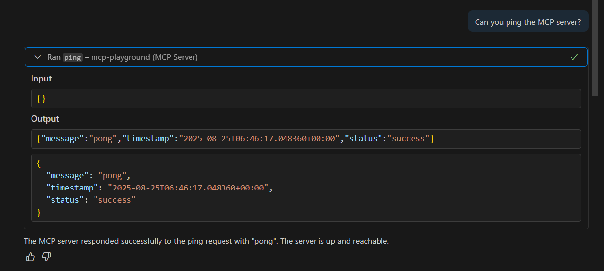
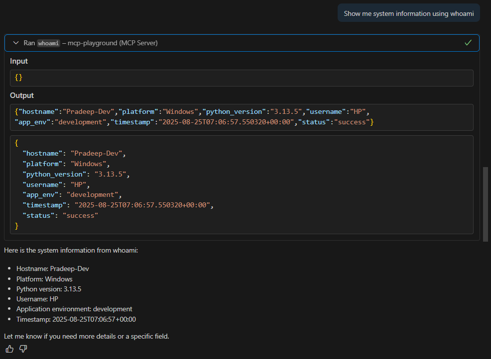
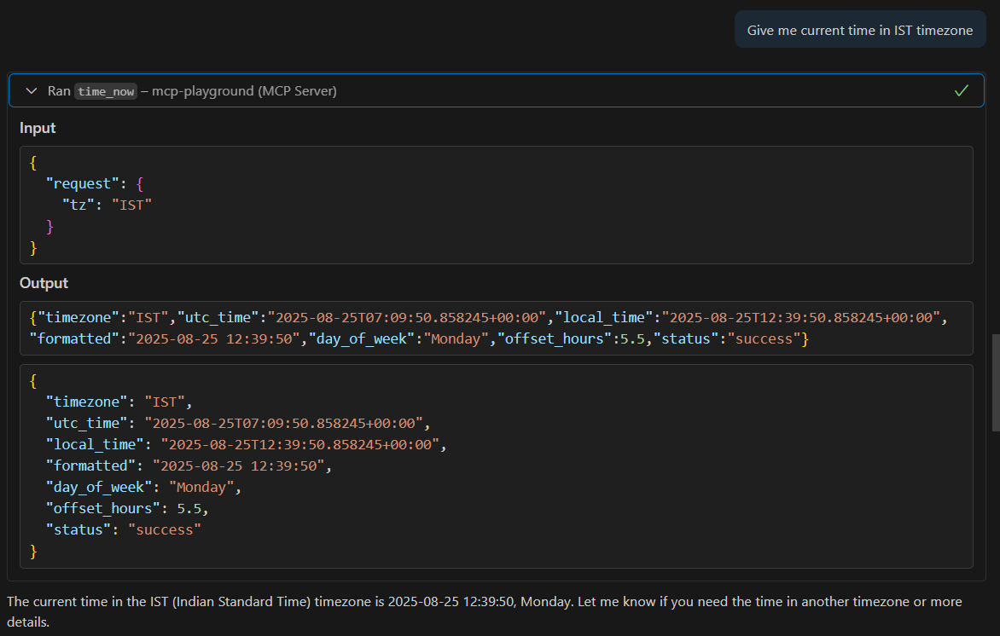
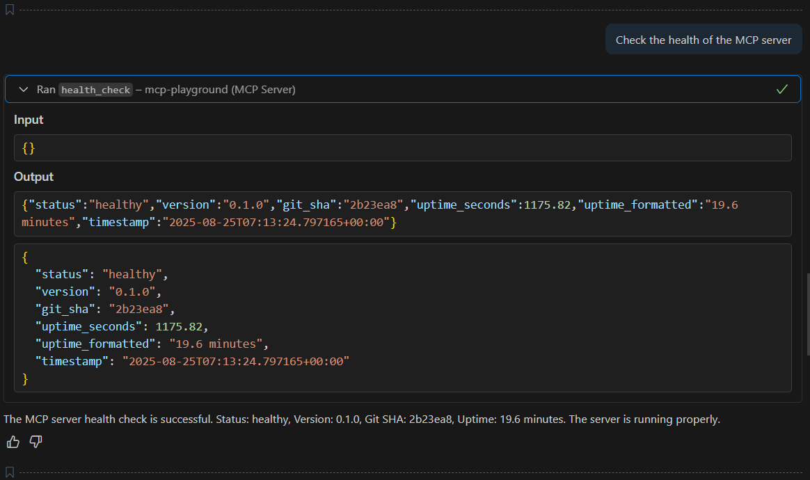

# MCP Server Demo

This document shows how we tested the MCP server using VS Code as the client.

---

## Setup
- Started MCP server using VS Code “Manual MCP Server” feature.
- Command: `python -m app`
- Verified that tools are registered.

---

## Tools and Results

### 1. Ping
- **Command:** `Can you ping the MCP server?`
- **Result:** Pong with timestamp.
- 

### 2. Whoami
- **Command:** `Show me system information using whoami
`
- **Result:** Hostname, platform, python version username, app env and timestamp
- 

### 3. Time Now
- **Command:** `Give me current time in IST timezone`
- **Result:** Current time in IST timezone.
- 

### 4. Health Check
- **Command:** `Check the health of the MCP server`
- **Result:** Status: Healthy, with version info.
- 

---

## Findings
- All tools worked as expected.  
- Invalid timezone input was correctly rejected with an error.  
- The server responds instantly, confirming that the MCP setup is working.  
